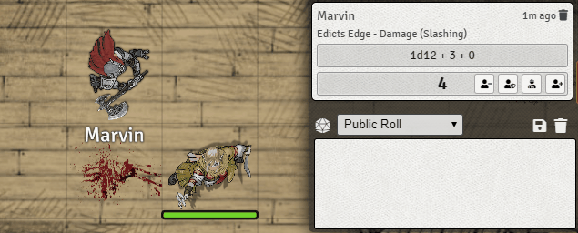

# Chat Damage Buttons (5e)

This module replaces the right-click context menu with buttons on the dice-roll chat message. 
- I believe the workflow for applying damage to tokens is smoother with buttons compared to the right-click context menu method.
- There is a bug with the right-click context menu currently when using the bottom most chat-message. This approach provides a work around for this issue.

### Current Issues:
- No known issues (give me your feedback!)

### Installation Instructions

To install a module, follow these instructions:

1. [Download the zip file](https://gitlab.com/hooking/foundry-vtt---chat-damage-buttons/raw/master/chatdamagebuttons5e.zip) included in the module directory. If one is not provided, the module is still in early development.
2. Extract the included folder to `public/modules` in your Foundry Virtual Tabletop installation folder.
3. Restart Foundry Virtual Tabletop.  

### Feedback

If you have any suggestions or feedback, please contact me on discord (hooking#0492)

Shoutout to Felix#6196 for the Spell-Browser module I used as an example of how to use hooks and modify the HTML appropirately. Also huge thanks again for helping to style the buttons elegantly, a huge help!